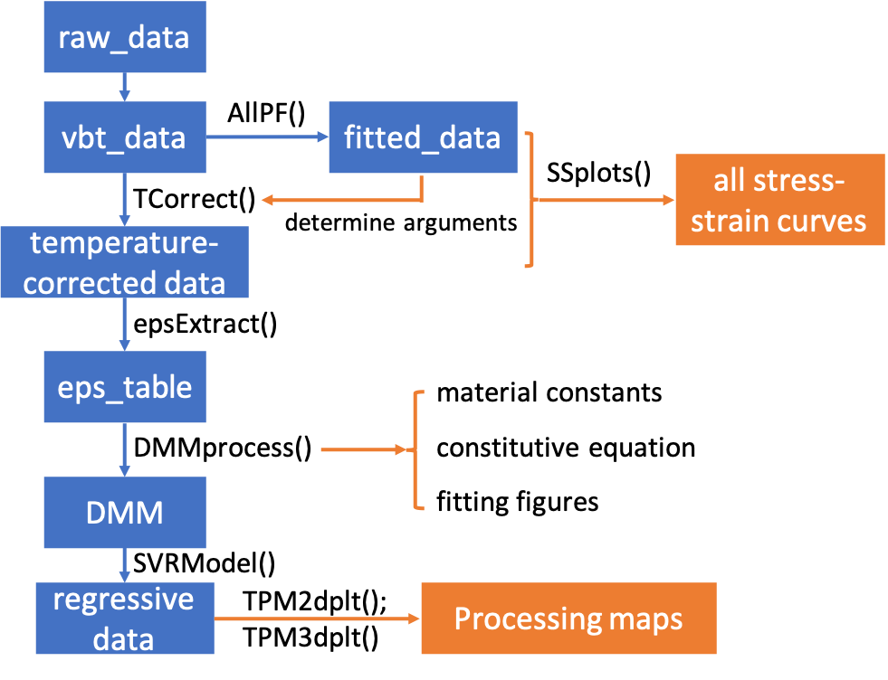

---
output:
  pdf_document: default
  html_document: default
---
# TPMplt package

**TPMplt**, short for thermal processing-map plot, is a tool-kit for constructing dynamic material model (DMM) and corresponding visualization

## Installation

### Installation from github:

```
if(! "devtools" %in% installed.packages()) install.packages("devtools")
devtools::install_github("CubicZebra/TPMplt")
```

### Installation from CRAN:

```
install.packages("TPMplt")
```

## Main functions

TPMplt is a tool-kit for building and visualizing the dynmaic materials model (DMM), suggested by [Prasad and Gegel](https://link.springer.com/article/10.1007/BF02664902). It provides an easy approach to calculate constructive functions and other related material constants based on a given strain condiiton. 2D and 3D processing-maps with temperature as its x axis, while logarithm strain rate as its y axis are also available.

## Workflow



## Processing Map Preview


## Attention

Some bugs occur in data extraction which results incorrect output of ```epsExtract()``` function (in the CRAN version). These problems were fixed in Git version. New submission for CRAN is coming soon.

## Contact

Author: ZHANG Chen

Mail: 447974102@qq.com
