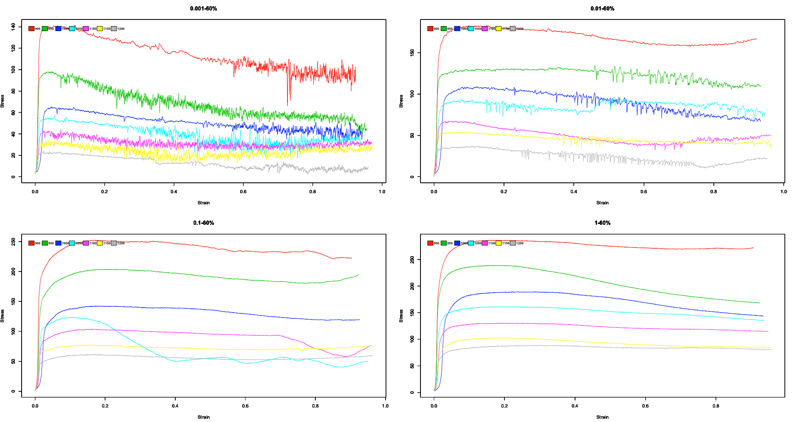
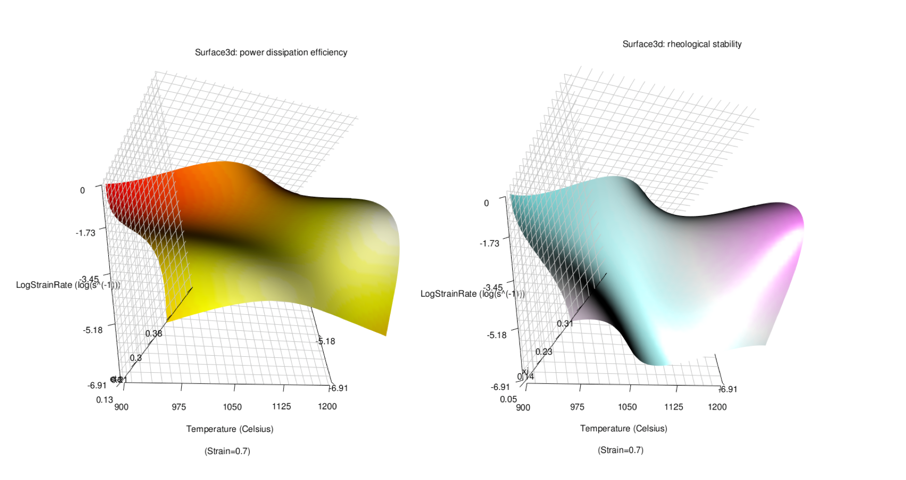
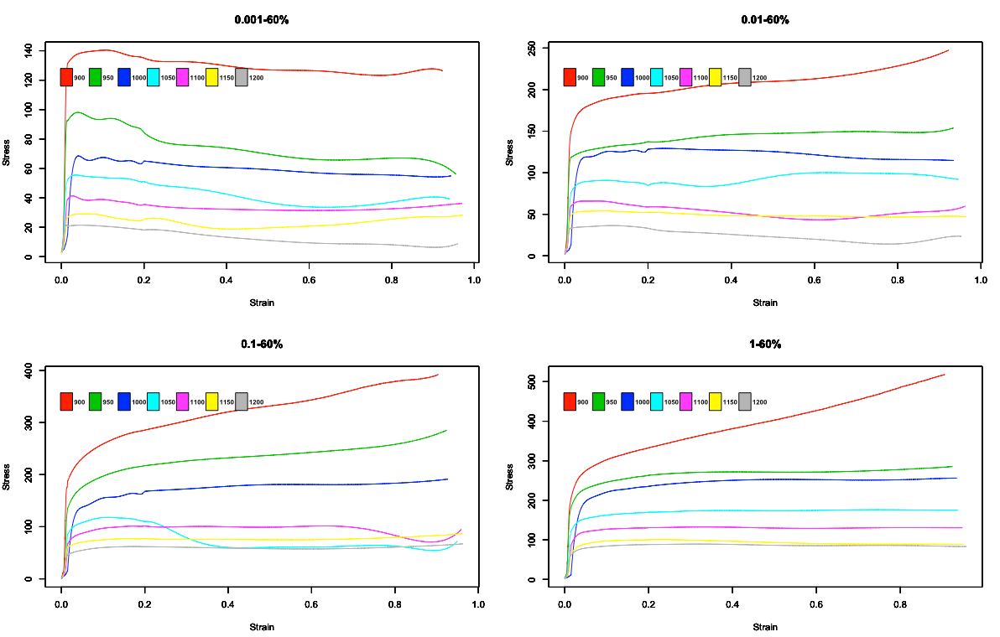
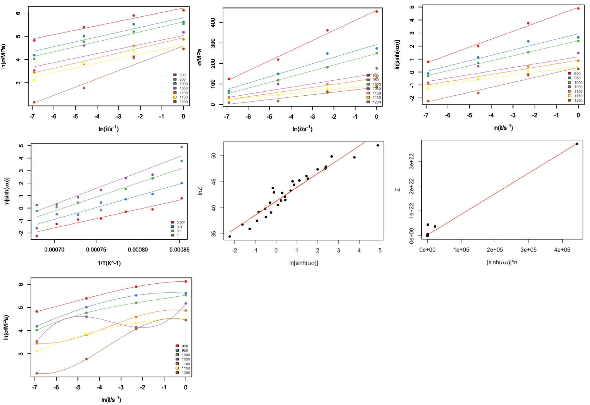
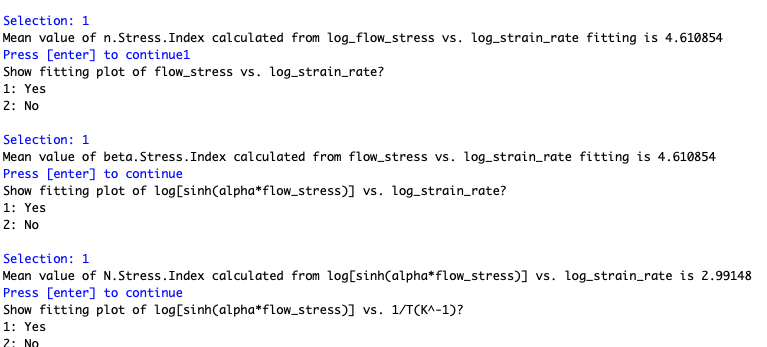
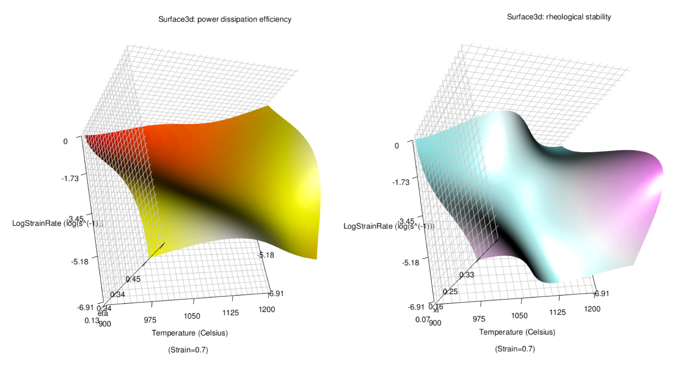

[](https://cran.r-project.org/package=TPMplt)
[](https://cran.r-project.org/package=TPMplt)
[](https://cran.r-project.org/package=TPMplts)
[](https://www.gnu.org/licenses/gpl-3.0)

# TPMplt package

**TPMplt**, short for thermal processing-map plot, is a tool-kit for constructing dynamic material model (DMM) and corresponding visualization

## Installation

### Installation from github:

```
if(! "devtools" %in% installed.packages()) install.packages("devtools")
devtools::install_github("CubicZebra/TPMplt")
```

### Installation from CRAN:

```
install.packages("TPMplt")
```

## Main functions

TPMplt is a tool-kit for building and visualizing the dynmaic materials model (DMM), suggested by [Prasad and Gegel](https://link.springer.com/article/10.1007/BF02664902). It provides an easy approach to calculate constructive functions and other related material constants based on a given strain condiiton. 2D and 3D processing-maps with temperature as its x axis, while logarithm strain rate as its y axis are also available.


## Workflow


### Multi-function polynomial fitting

The function  ```AllPF()``` can apply polynomial fitting for all user-customized subsections for all raw stess-strain curves.

The raw data will be like:



After multi-functional polynomial fitting, the curves will be:



### Temperature correction

Before making the processing maps, temperature correction should be applied. By calling the function ```TCorrect()``` to the raw data, the fitted result will be:



### Computation for dynamic material model and output corresponding figures

The key function to build dynamic material model (DMM) from raw data is achieved by ```DMMprocess()```. This function has two most important arguments: ```InteractMode``` and ```ConsFun```. The argument ```InteractMode``` control the output of figures and parameters computed for DMM, here're some examples:



Related parameters will be printed out in console when ```InteractMode``` is TRUE:



## Processing Map Preview

### Tranditional 2D processing map

Afer making the model and applying regression, the 2D processing map can be generated as:


The background in gradient colors informs the stability coefficient $\xi$ while the contours reminds the power dissipation efficiency $\eta$.

### 3D processing maps

$\xi$ and $\eta$ can also be respectively generated using the 3D plot function. The result will be as:



## Contact

Author: ZHANG Chen

Mail: 447974102@qq.com
