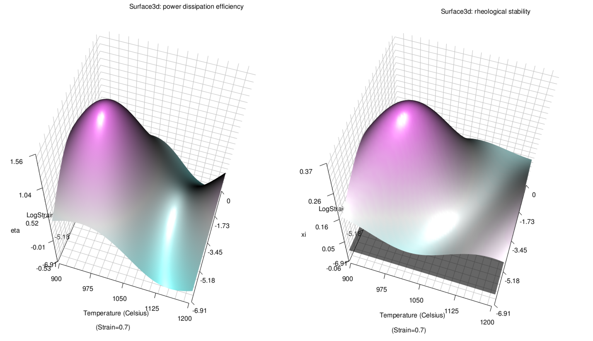

```{r setup, include = FALSE}
knitr::opts_chunk$set(
  collapse = TRUE,
  comment = "#>"
)
```

## Main functions

TPMplt is a tool-kit for building and visualizing the dynmaic materials modeling (DMM), suggested by [Prasad and Gegel](https://link.springer.com/article/10.1007/BF02664902). It provides an easy approach to calculate constructive functions and other related coefficients based on a given strain condiiton. 2D and 3D processing-maps with temperature as its x axis, while logarithm strain rate as its y axis are also available.

## Input data

Valid data for TPMplt strictly obey the management logic of [VBTree package](https://cran.r-project.org/web/packages/VBTree/index.html). Additionally, factors for temperature (celsius) and strain rates should be written in the format of pure numeric. All different variables are desired to be connected using "-". For example, if there's a strain data collected in the conditions of 900 celsius, $10^{-3}$ strain rate, "0.001-Strain-900" is one of available column names for this data, rather than "10e-3-Strain-T900", "SR0.001-Strain-1173K" or such like.

The following codes partially display a typical valid data for TPMplt:

```{r}
library(TPMplt)
head(TPMdata[,1:3])

```

Users can apply any applicable tools to make the summary table for TPMplt, with the format as above-showed.

Besides, it is common to obtain multiple exported files based on different experiments. TPMplt affords two functions to automatically generate a summary table from multiple exported files. For details, please check the R documents for ```API4TMZ``` and ```TMZdatainput```.

## Extraction based on given strain

It is necessary to build the conceptions for layers and levels in layer for variables, defined by [VBTree package](https://cran.r-project.org/web/packages/VBTree/index.html). For example, run the following codes to check all column names in the demo dataset in TPMplt pacakge:

```{r}
colnames(TPMdata)
```

As we seen, all column names are arranged by the style of "(Strain&Stress)-(Temperature)-(Strain Rate)-(Other)". Under this circumstance, we call the layer for temperature is 2, while the layer for strain rate is 3.

The function ```epsExtract``` is capable to export a strain rate-temperature table by specifying ```eps``` as the strain condition. However, ```lyT``` and ```lySR```, the two urgent arguments corresponding to layers for temperature and strain rate respectively, need correct declaration as well.

Executinge the following codes:

```{r}
require(VBTree)
dl2vbt(chrvec2dl(colnames(TPMdata)))
```

The complete structure for all variables is showed. As the result showed above, there're 7 temperatures and 4 strain rates in our summary table, therefore the levels for temperature and strain rate are 7 and 4 respectively. Based on all introduced knowledge, we can easily find that all factors will be corresponded with a unique coordinates of (layer, level). For example, we can define the factor "950" is located in layer 2, level 2.

If we want the strain rate-temperature table in condition of 0.7 strain, running the following codes the result will be returned automatically:

```{r}
epstable <- epsExtract(TPMdata, eps = 0.7, lyT = 2, lySR = 3)
epstable
```

Pay attention, for correct exporting, the number of levels for Strain and Stress must be 2 in our input data.

Additionally, although the function ```epsExtract``` can automatically read the layer and levels for Strain and Stress using specific regex in most conditions, it is not guaranteed to be matched correctly everytime. If mismatch occurs, please manually set the argument ```manual``` in ```epsExtract``` according to its R document.

## Automatic calculation

On the basis of dynamic materials modeling (DMM), constructive function and all material coefficients can be calculated from a certain strain rate-temperature table. The function ```DMMprocess``` has built in all steps for DMM processing. Applying it on our previous result, the complete output can be observed as following:

```{r}
DMM <- DMMprocess(epstable)
DMM
```

If the constructive function is the thing we only concerned, set the argument ```consfuncPRT``` as TRUE:

```{r}
DMM <- DMMprocess(epstable, consfuncPRT = TRUE)
```


## Preparation for visualization

As we can see, the "etatable" and "xitable" in tablelist are two key parts for building processing-map. The former is for power dissipation efficiency factor eta, and the later is for rheological stability coefficient xi. However, since the values in both are discrete, regression process for these tables is necessary.

Support vector regression ([SVR](https://link.springer.com/article/10.1023/B:STCO.0000035301.49549.88)) is recommanded. The function ```SVRModel``` will return a regression result which can be utilized by ploting functions.

The following demonstration save the returned result into the vairable "PLTbd", for the meaning of "Plots builder".

```{r}
PLTbd <- SVRModel(DMM)
```

## 2D processing map visualization

Function ```TPM2dplt``` can generate a thermal processing map from regression result easily. Following codes demonstrates the processing map from "PLTbd":

```{r, fig.show='hold', fig.height=4, fig.width=6}
TPM2dplt(PLTbd)
```

From the plot we can find that power dissipation efficiency factor eta is denoted by contour with gradual colors, while the rheological stability coefficient xi is represented by a gradient colours from green (high) to red (low). Annotation in top-left show the strain condition for current processing map.

Locations for annotation, gradient colors for rheological stability coefficient xi is customizable in ```TPM2dplt``` function. But since the color for eta is fixed, please try not to use blue or such like, to avoid ambiguous result.

## 3D processing map visualization

Function ```TPM3dplt``` can generate a thermal processing results as similar as ```TPM2dplt``` did. The difference is, eta and xi will be separately plotted.

By running the following code, we can easily obtain the results as Fig.1 showed.

```{r}
TPM3dplt(PLTbd)
```



These two 3d plots are generated using through the rgl package, therefore it will be very convenient to utilize 3d rotation on our generated plots, for analysis in details.

Especially, the xi plots is coupled with a specific plane, z=0, in order to divide the stable and unstable regions.
